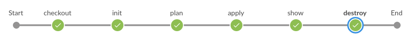

# Terraform AWS EC2 Module


Simple terraform module testing with `localstack`.



## Example

```sh
provider "aws" {
  access_key                  = "mock_access_key"
  region                      = "eu-central-1"
  s3_force_path_style         = true
  secret_key                  = "mock_secret_key"

  endpoints {
    ec2            = "http://127.0.0.1:4566"
  }
}
```
